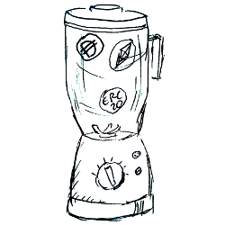

# miksi [](https://github.com/miksi-labs/miksi-core/actions?query=workflow%3ATest)

*From Esperanto, **miksi** (miks·i): to mingle, to blend, to mix, to shuffle*




**Warning:** This repository is in a very early stage.

## Circuits tests
```
npm run test-circuits
```

## Smart Contracts tests
```
npm run test-sc
```

### Compile circom circuit & generate Groth16 verifier contract

```
./compile-circuits.sh
```

